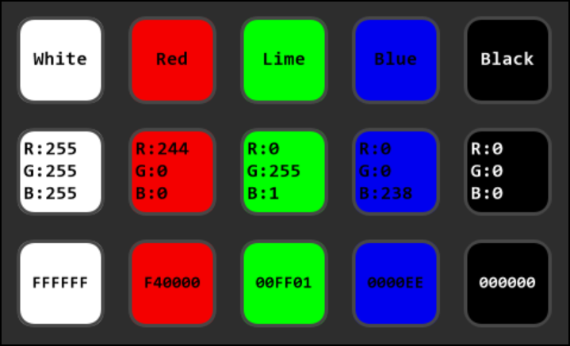
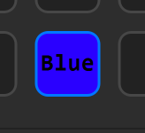
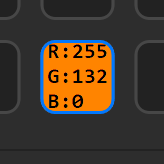
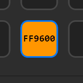

# Color Picker for StreamDeck

## Description

As a [color-blind](https://en.wikipedia.org/wiki/Color_blindness) person sometimes I struggle to recognize certain colors, so I thought it would be nice to have the functionality of [WhatColor](http://www.hikarun.com/e/) in StreamDeck. And while I was there, I decided to add the options to show their RGB or hexadecimal value.

When pressed, it will get the color information (name, RGB, or hexadecimal) of the pixel where the mouse is and show it on the StreamDeck key. Optionally, the the value can be copied to the clipboard

.

It was done using BarRaider's [Stream Deck Tools](https://github.com/BarRaider/streamdeck-tools).

For Mac users, the user mbelltbg created a script with a similar functionality. It can be found at [mac-streamdeck-color-picker](https://github.com/mbelltbg/mac-streamdeck-color-picker).

## Features

### Color Picker
- Can show three different color values
  - Color name
  - RGB values
  - Hexadecimal value
- Three behaviour modes
  - On key press
  - Dynamic
  - Fixed
- Customizable color name definitions
  - The names are taken from a json file with a list with a color name and its RGB value
  - The default is a slightly modified version of [WhatColor](http://www.hikarun.com/e/)'s recommended setting
  - Also included is the VGA definition also taken from [WhatColor](http://www.hikarun.com/e/) settings
- Values can be copied to the clipboard

## Color Palette 🆕
- Can store color hex values, even after closing the StremDeck app
- Quick press: Store value
- A slightly longer press: Copy value to clipboard on release
  - It only requires 1/4 second to keep it pressed to copy the value

## Color Values

### Color Names

.

This value option will show the name of the color on the key's screen.

The plugin breaks multi words names into new lines, so its best not to use with more than 3 words on it or it wont fit the key's screen It also resizes the font based on the longest word. `Cornflower` can be read, but anything longer and it might be too small to be read.

The colors name definition is stored in a file named `Colors.definition.json`, based on [WhatColor](http://www.hikarun.com/e/)'s recommended setting, found in a folder named ColorsDefinitions at the root folder of the plugin. At the moment, the plugin only loads this file, if you wish to change the definition file, you can either modify this file or replace it.

When the copy to clipboard option is selected, the name of the color will be copied (including new lines).

### Color RGB Value

When this value option is selected, it will show the RGB values of the pixel.

When the copy to clipboard option is selected, only the numeric values delimited by a comma will be copied.

### Color Hexadecimal Value

When this value option is selected, it will show the hexadecimal value of the pixel.

When the copy to clipboard option is selected, the hexadecimal value without the number sign will be copied to the clipboard.

## Behaviours

### On Key Press

It will update the color value of the pixel where the mouse is at whenever the key is pressed.

It will also copy the value of the color if the option it is activated.

### Dynamic

The key screen will be automatically updated at a refresh rate of 10ms.

When the key is pressed, and if the option is selected, the value will be copied to the clipboard.

### Fixed

Similar to Dynamic, except it wont follow the mouse location.

Instead, when the key is pressed the location of the mouse is updated and will stay ready the color of the pixel at that location.

If the copy to clipboard option is activated, it will update the copied value at the same speed of the refresh rate.

## My others Stream Deck plugins

- **[KeePass for StreamDeck](https://github.com/VictorGrycuk/StreamDeck-KeePass)**
- **[Magnifier](https://github.com/VictorGrycuk/streamdeck-magnifier)**

* * *

The icons are modified version of _Color_ and _iOS Filled_ at [Icon8](https://icons8.com).
